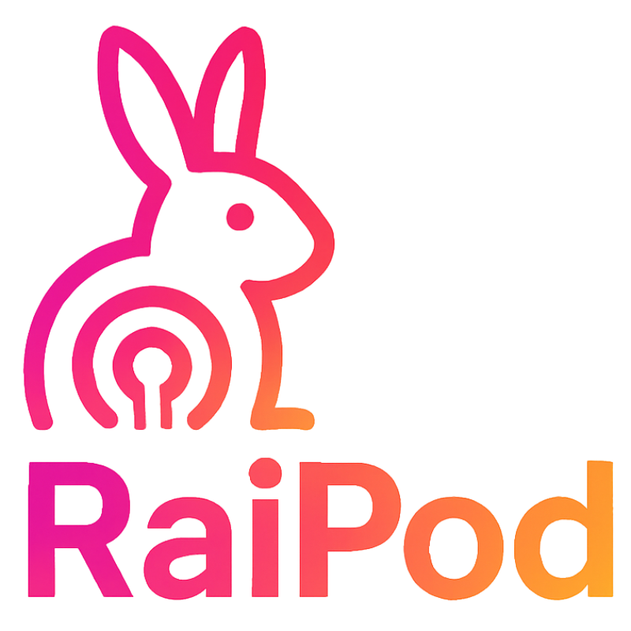

# RaiPod - AI播客生成器

<div align="center">
  


  <h3>将任何网页内容转换为AI播客对话</h3>

  []()
  []()
  []()
  []()
</div>

## 🚧 当前状态

**项目状态**: 框架搭建完成，可成功导入Chrome浏览器

✅ **已完成**:
- 完整的Chrome扩展框架(Manifest V3)
- TypeScript + React + Webpack开发环境
- 弹窗界面(Popup)和选项页面(Options)UI框架
- 后台服务(Background Service Worker)架构
- 内容脚本(Content Script)框架
- 共享模块和工具函数
- SVG图标资源和构建配置
- 项目可成功构建并导入Chrome

🔄 **进行中**:
- 核心功能逻辑实现
- AI API集成
- TTS服务集成
- 用户界面交互完善

📋 **待完成**:
- 完整的播客生成流程
- 音频播放功能
- 错误处理和用户体验优化

## ✨ 功能特性

- 🤖 **智能内容提取** - 自动识别并提取网页核心内容
- 🎙️ **AI播客生成** - 将文本内容转换为自然的播客对话
- 🔊 **语音合成** - 支持多种TTS服务，生成高质量音频
- 🎵 **音频播放** - 内置播放器，支持播放控制和进度调节
- 💾 **会话管理** - 保存和管理播客会话历史
- ⚙️ **灵活配置** - 支持自定义AI模型和TTS服务
- 🎨 **现代UI** - 基于Ant Design的美观界面

## 🚀 快速开始

### 环境要求

- Node.js 16+
- Chrome 浏览器
- AI API密钥（如OpenAI、Claude等）
- TTS服务API密钥

### 安装步骤

1. **克隆项目**
   ```bash
   git clone https://github.com/your-username/RaiPod.git
   cd RaiPod
   ```

2. **安装依赖**
   ```bash
   npm install
   ```

3. **构建扩展**
   ```bash
   npm run build
   ```

4. **加载到Chrome**
   - 打开Chrome浏览器
   - 访问 `chrome://extensions/`
   - 开启"开发者模式"
   - 点击"加载已解压的扩展程序"
   - 选择项目的 `dist` 文件夹
   - 扩展成功加载后，可在工具栏看到RaiPod图标

> **注意**: 当前版本为框架版本，UI界面已完成但核心功能逻辑仍在开发中。扩展可以正常安装和打开界面，但播客生成功能尚未实现。

### 开发模式

```bash
# 启动开发服务器
npm run dev

# 监听文件变化并自动构建
npm run watch
```

## 📖 使用指南

### 基本使用

1. **配置服务**
   - 点击扩展图标打开弹窗
   - 进入设置页面配置AI Agent和TTS服务
   - 输入相应的API密钥和服务地址

2. **生成播客**
   - 在任意网页上点击扩展图标
   - 系统自动提取页面内容
   - 点击"生成播客"开始AI处理
   - 等待语音合成完成

3. **播放和管理**
   - 使用内置播放器控制播放
   - 在历史记录中查看所有会话
   - 导出音频文件或删除不需要的会话

## 🏗️ 项目结构

```
RaiPod/
├── src/
│   ├── background/          # 后台脚本
│   │   ├── service-worker.ts
│   │   ├── ai-service.ts
│   │   ├── tts-service.ts
│   │   ├── audio-player.ts
│   │   └── podcast-manager.ts
│   ├── content/             # 内容脚本
│   │   ├── content-script.ts
│   │   └── content-extractor.ts
│   ├── popup/               # 弹窗界面
│   │   ├── Popup.tsx
│   │   ├── Popup.css
│   │   ├── index.tsx
│   │   ├── index.css
│   │   └── popup.html
│   ├── options/             # 设置页面
│   │   ├── Options.tsx
│   │   ├── Options.css
│   │   ├── index.tsx
│   │   ├── index.css
│   │   └── options.html
│   ├── shared/              # 共享模块
│   │   ├── types.ts
│   │   ├── constants.ts
│   │   ├── utils.ts
│   │   └── storage.ts
│   └── assets/              # 静态资源
│       ├── icon-16.png
│       ├── icon-32.png
│       ├── icon-48.png
│       └── icon-128.png
├── dist/                    # 构建输出
├── webpack.config.js        # Webpack配置
├── tsconfig.json           # TypeScript配置
├── package.json            # 项目配置
└── manifest.json           # 扩展清单
```

## 🔧 技术栈

- **前端框架**: React 18 + TypeScript
- **UI组件库**: Ant Design
- **构建工具**: Webpack 5
- **扩展API**: Chrome Extension Manifest V3
- **状态管理**: React Hooks
- **样式方案**: CSS + Ant Design主题

## 📊 性能优化

- **内存管理**: 500MB音频缓存限制
- **异步处理**: 非阻塞的AI和TTS调用
- **资源预加载**: 智能音频预加载策略
- **错误恢复**: 自动重试和降级处理

## 🔒 隐私安全

- 本地数据存储，不上传用户内容
- API密钥加密存储
- 最小权限原则
- 用户数据完全可控

## 🤝 贡献指南

1. Fork 项目
2. 创建功能分支 (`git checkout -b feature/AmazingFeature`)
3. 提交更改 (`git commit -m 'Add some AmazingFeature'`)
4. 推送到分支 (`git push origin feature/AmazingFeature`)
5. 开启 Pull Request

## 📝 更新日志

### v1.0.0 (2024-01-XX)

- ✨ 初始版本发布
- 🎙️ 基础播客生成功能
- 🔊 TTS语音合成集成
- 🎵 音频播放器
- ⚙️ 配置管理系统
- 💾 会话历史管理

## 📄 许可证

本项目采用 MIT 许可证。

---

<div align="center">
  <p>如果这个项目对您有帮助，请给它一个 ⭐️</p>
  <p>Made with ❤️ by RaiPod Team</p>
</div> - AI播客Chrome插件

一个基于Chromium浏览器引擎的AI播客插件，能够将网页内容转换为生动的双人对话播客。

## 🎯 核心功能

### 主要特性
- 📄 **智能内容提取**：自动获取当前标签页的网页内容
- 🤖 **AI对话生成**：通过大模型生成自然的双人播客对话
- 🎵 **语音合成播放**：支持两种不同音色的TTS，交替播放对话内容
- ⚙️ **灵活配置**：支持多个AI模型和TTS服务配置
- 💾 **本地存储**：所有配置信息持久化保存
- 🎮 **实时控制**：播放控制、文本同步显示、内容复制

### 扩展功能规划
- 📋 AI网页内容总结
- 🧠 AI思维导图生成
- 📊 内容分析报告
- 🎨 更多创意AI功能

## 🏗️ 技术架构

### 整体架构
```
┌─────────────────┐    ┌─────────────────┐    ┌─────────────────┐
│   Content       │    │   Background    │    │   Popup/Options │
│   Script        │───▶│   Service       │◀───│   UI            │
│                 │    │   Worker        │    │                 │
└─────────────────┘    └─────────────────┘    └─────────────────┘
        │                       │                       │
        ▼                       ▼                       ▼
┌─────────────────┐    ┌─────────────────┐    ┌─────────────────┐
│   网页内容提取    │    │   AI API调用     │    │   配置管理界面   │
│   DOM解析        │    │   音频生成       │    │   播放控制       │
│   文本清理       │    │   队列管理       │    │   文本显示       │
└─────────────────┘    └─────────────────┘    └─────────────────┘
```

### 核心模块

#### 1. 内容提取模块 (Content Script)
- **功能**：提取当前页面的主要文本内容
- **技术**：DOM解析、智能内容识别、文本清理
- **输出**：结构化的页面内容数据

#### 2. AI对话生成模块 (Background Service)
- **功能**：调用大模型API生成播客对话
- **支持**：OpenAI兼容API、自定义提示词、多模型配置
- **输出**：结构化的对话内容（角色A/B交替）

#### 3. 语音合成模块 (Background Service)
- **功能**：将对话文本转换为语音
- **支持**：自定义TTS API、curl命令配置、并行生成
- **优化**：预加载机制，边播放边生成下一段

#### 4. 播放控制模块 (Popup UI)
- **功能**：音频播放控制、进度显示、文本同步
- **特性**：播放/暂停、进度条、当前对话高亮

#### 5. 配置管理模块 (Options Page)
- **功能**：AI模型配置、TTS配置、偏好设置
- **存储**：Chrome Storage API本地持久化

## 📋 详细功能规格

### 1. AI模型配置
```json
{
  "agents": [
    {
      "id": "agent_1",
      "name": "GPT-4播客专家",
      "apiUrl": "https://api.openai.com/v1/chat/completions",
      "apiKey": "sk-xxx",
      "model": "gpt-4",
      "systemPrompt": "你是一个专业的播客主持人...",
      "temperature": 0.7,
      "maxTokens": 2000
    }
  ]
}
```

### 2. TTS配置
```json
{
  "ttsConfigs": {
    "voiceA": {
      "name": "角色A - 男声",
      "curlCommand": "curl -X POST https://api.tts.com/v1/speak -H 'Authorization: Bearer {apiKey}' -H 'Content-Type: application/json' -d '{\"text\": \"{text}\", \"voice\": \"male_voice\"}'"
    },
    "voiceB": {
      "name": "角色B - 女声",
      "curlCommand": "curl -X POST https://api.tts.com/v1/speak -H 'Authorization: Bearer {apiKey}' -H 'Content-Type: application/json' -d '{\"text\": \"{text}\", \"voice\": \"female_voice\"}'"
    }
  }
}
```

### 3. 播客生成流程
1. **内容提取**：获取当前页面主要内容
2. **AI处理**：发送给选定的AI模型生成对话
3. **语音合成**：并行调用TTS API生成音频
4. **播放管理**：按顺序播放，同时预加载下一段
5. **界面同步**：实时显示当前播放的对话文本

### 4. 性能优化策略
- **并行处理**：AI生成和TTS合成并行执行
- **预加载机制**：播放当前段时预生成下一段音频
- **缓存策略**：相同内容的音频文件本地缓存
- **分段处理**：长文本分段处理，避免超时

## 🎨 UI设计规范

### 设计原则
- **简洁美观**：现代化Material Design风格
- **易用性**：直观的操作流程，最少点击完成任务
- **扩展性**：模块化设计，便于添加新功能
- **响应式**：适配不同屏幕尺寸

### 主要界面

#### 1. Popup主界面 (320x600px)
```
┌─────────────────────────────────┐
│  🎙️ RaiPod                      │
├─────────────────────────────────┤
│  📄 当前页面：技术文章标题        │
│  🤖 AI模型：GPT-4播客专家        │
│  🎵 音色A：男声 | 音色B：女声     │
├─────────────────────────────────┤
│  ▶️ 生成播客                     │
├─────────────────────────────────┤
│  播放控制区域                    │
│  ⏸️ ⏭️ 🔊 ━━━━━━━━━━ 2:30/5:45  │
├─────────────────────────────────┤
│  📝 对话文本显示区域              │
│  👨 角色A：这篇文章讲述了...      │
│  👩 角色B：确实很有趣，特别是...   │
│  📋 复制文本                     │
└─────────────────────────────────┘
```

#### 2. 配置页面 (Options)
- **AI模型管理**：添加/编辑/删除AI配置
- **TTS配置**：音色设置和API配置
- **通用设置**：默认选项、缓存管理

## 🛠️ 技术实现

### 开发技术栈
- **前端框架**：React + TypeScript
- **UI组件**：Material-UI / Ant Design
- **状态管理**：Redux Toolkit
- **构建工具**：Webpack + Babel
- **样式方案**：Styled-components / CSS Modules
- **音频处理**：Web Audio API

### Chrome扩展结构
```
src/
├── manifest.json           # 扩展配置文件
├── background/             # 后台服务
│   ├── service-worker.ts   # 主服务worker
│   ├── ai-service.ts       # AI API调用服务
│   ├── tts-service.ts      # TTS服务
│   └── audio-manager.ts    # 音频管理
├── content/                # 内容脚本
│   ├── content-script.ts   # 页面内容提取
│   └── content-extractor.ts# 智能内容解析
├── popup/                  # 弹窗界面
│   ├── index.tsx          # 主界面组件
│   ├── components/        # UI组件
│   └── hooks/             # 自定义hooks
├── options/                # 配置页面
│   ├── index.tsx          # 配置界面
│   └── components/        # 配置组件
├── shared/                 # 共享模块
│   ├── types.ts           # 类型定义
│   ├── storage.ts         # 存储管理
│   ├── utils.ts           # 工具函数
│   └── constants.ts       # 常量定义
└── assets/                 # 静态资源
    ├── icons/             # 图标文件
    └── styles/            # 全局样式
```

### 关键API设计

#### 1. 内容提取API
```typescript
interface PageContent {
  title: string;
  content: string;
  url: string;
  timestamp: number;
}

function extractPageContent(): Promise<PageContent>
```

#### 2. AI对话生成API
```typescript
interface DialogueItem {
  speaker: 'A' | 'B';
  text: string;
  timestamp: number;
}

function generatePodcast(
  content: PageContent,
  agentConfig: AgentConfig
): Promise<DialogueItem[]>
```

#### 3. TTS合成API
```typescript
interface AudioSegment {
  id: string;
  audioUrl: string;
  duration: number;
  speaker: 'A' | 'B';
}

function synthesizeAudio(
  text: string,
  ttsConfig: TTSConfig
): Promise<AudioSegment>
```

## 📦 安装和使用

### 开发环境搭建
```bash
# 克隆项目
git clone https://github.com/your-username/RaiPod.git
cd RaiPod

# 安装依赖
npm install

# 开发模式
npm run dev

# 构建生产版本
npm run build
```

### Chrome扩展安装
1. 打开Chrome浏览器
2. 进入 `chrome://extensions/`
3. 开启"开发者模式"
4. 点击"加载已解压的扩展程序"
5. 选择项目的 `dist` 目录

### 使用步骤
1. **配置设置**：首次使用需要配置AI模型和TTS服务
2. **浏览内容**：打开想要转换为播客的网页
3. **生成播客**：点击扩展图标，选择配置后点击"生成播客"
4. **享受播客**：等待生成完成后即可播放收听

## 🔧 配置说明

### AI模型配置示例

#### OpenAI GPT-4
```json
{
  "name": "OpenAI GPT-4",
  "apiUrl": "https://api.openai.com/v1/chat/completions",
  "apiKey": "sk-your-api-key",
  "model": "gpt-4",
  "systemPrompt": "你是播客栏目的专家，负责编写播客的对话内容，需要将给定的文章内容转换为生动有趣的双人对话。角色A是主持人，角色B是嘉宾。对话要自然流畅，有问有答，能够帮助听众更好地理解文章内容。
请直接返回Json数组格式，数组中是两个角色依次的对话内容，示例：[{{\"user\":\"A\",\"content\":\"哈喽，各位听众朋友们，大家好...\"}},{{\"user\":\"B\",\"content\":\"是的，这个话题非常有意思...\"}},{{\"user\":\"A\",\"content\":\"你怎么看待这个问题呢...\"}}]"
}
```

#### 本地大模型 (Ollama)
```json
{
  "name": "本地Llama2",
  "apiUrl": "http://localhost:11434/v1/chat/completions",
  "apiKey": "ollama",
  "model": "llama2",
  "systemPrompt": "..."
}
```

### TTS配置示例

#### Azure TTS
```bash
curl -X POST "https://eastus.tts.speech.microsoft.com/cognitiveservices/v1" \
  -H "Ocp-Apim-Subscription-Key: YOUR_KEY" \
  -H "Content-Type: application/ssml+xml" \
  -H "X-Microsoft-OutputFormat: audio-16khz-128kbitrate-mono-mp3" \
  -d '<speak version="1.0" xml:lang="zh-CN"><voice xml:lang="zh-CN" xml:gender="Male" name="zh-CN-YunxiNeural">{text}</voice></speak>'
```

#### 阿里云TTS
```bash
curl -X POST "https://nls-gateway.cn-shanghai.aliyuncs.com/stream/v1/tts" \
  -H "Authorization: Bearer YOUR_TOKEN" \
  -H "Content-Type: application/json" \
  -d '{"text": "{text}", "voice": "xiaoyun", "format": "mp3"}'
```

## 🚀 开发计划

### Phase 1: 核心功能 (v1.0)
- [x] 基础项目结构
- [x] Chrome扩展框架搭建
- [x] TypeScript + React + Webpack配置
- [x] Manifest V3配置文件
- [x] 内容提取模块框架
- [x] AI对话生成服务框架
- [x] TTS语音合成服务框架
- [x] 音频播放管理框架
- [x] 播客会话管理框架
- [x] 基础播放控制UI框架
- [x] 配置管理界面框架
- [x] 弹窗界面(Popup)完整实现
- [x] 选项页面(Options)完整实现
- [x] 共享工具模块(types, storage, utils)
- [x] SVG图标资源
- [x] 项目构建和打包配置
- [ ] 功能逻辑具体实现
- [ ] API集成和测试
- [ ] 错误处理完善

### Phase 2: 功能完善 (v1.1)
- [ ] 性能优化（预加载、缓存）
- [ ] UI/UX改进
- [ ] 错误处理和重试机制
- [ ] 多语言支持
- [ ] 导出功能（音频文件、文本）

### Phase 3: 功能扩展 (v2.0)
- [ ] AI网页总结
- [ ] AI思维导图生成
- [ ] 批量处理
- [ ] 云端同步
- [ ] 社区分享

## 🤝 贡献指南

欢迎提交Issue和Pull Request！

### 开发规范
- 使用TypeScript进行类型安全开发
- 遵循ESLint和Prettier代码规范
- 编写单元测试覆盖核心功能
- 提交前运行完整的测试套件

### 提交规范
```
feat: 添加新功能
fix: 修复bug
docs: 更新文档
style: 代码格式调整
refactor: 代码重构
test: 添加测试
chore: 构建工具或依赖更新
```

## 📄 许可证

MIT License - 详见 [LICENSE](LICENSE) 文件

## 🙋‍♂️ 常见问题

### Q: 支持哪些网站？
A: 理论上支持所有网站，但对于结构化内容（如新闻、博客、文档）效果最佳。

### Q: AI生成的对话质量如何？
A: 质量主要取决于所选择的AI模型和提示词配置，建议使用GPT-4等高质量模型。

### Q: TTS服务有推荐吗？
A: 推荐Azure TTS、阿里云TTS、腾讯云TTS等，音质较好且支持中文。

### Q: 可以离线使用吗？
A: 目前需要网络连接调用AI和TTS服务，未来计划支持本地模型。

---

**RaiPod** - 让每个网页都变成有趣的播客 🎙️