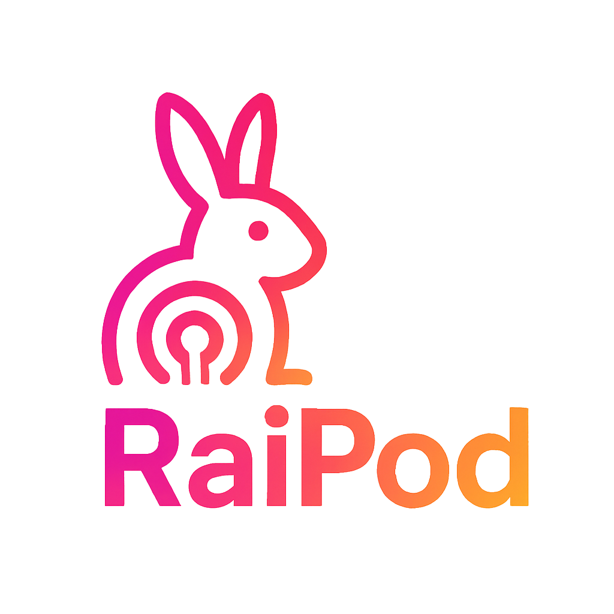

# RaiPodcast - AI播客生成器

<div align="center">
  
  <h3>🎙️ 将网页的图文内容转换为AI播客双人对话</h3>

  []()[]()[]()[]()[]()
</div>

## 📖 项目简介

RaiPodcast 是一款创新的浏览器（Chromium内核）扩展，能够智能地将网页内容转换为生动有趣的AI播客对话。通过先进的AI技术和语音合成服务，为用户提供全新的内容消费体验。

### ✨ 核心功能

- 🤖 **智能内容提取** - 自动识别并提取网页核心内容，支持文本和图片
- 🎭 **AI对话生成** - 将文章转换为主持人与嘉宾的自然对话形式
- 🔊 **多平台语音合成** - 支持多种TTS服务，生成高质量双声道音频
- 🎵 **实时音频播放** - 内置播放器，支持播放控制和进度管理
- ⚙️ **灵活配置** - 自定义AI模型、TTS服务和角色声音
- 🎨 **现代化界面** - 基于Ant Design的美观用户界面

## 🚀 下载与安装

### 支持的浏览器

- ✅ **Chrome** (推荐)
- ✅ **Microsoft Edge**
- ✅ **360** 浏览器
- ✅ **其他基于Chromium的浏览器**

### 安装步骤

#### 方式一：CRX 文件安装（推荐）

> ⚠️ **重要提示**：Chrome 由于安全策略可能会导致 `CRX_REQUIRED_PROOF_MISSING` 错误，建议改用 **其它浏览器**，或在 Chrome 快捷方式目标后添加 `--enable-easy-off-store-extension-install` 参数，或使用方式二安装。

1. **下载CRX文件**
   - 访问 [GitHub Releases](https://github.com/Bellzs/RaiPodcast/releases)
   - 下载最新版本的压缩包
   - 解压获得`.crx`文件
   
2. **安装到浏览器**
   - 打开浏览器（推荐 Edge 或已修改参数的 Chrome）
   - 访问扩展管理页面：[chrome://extensions/](chrome://extensions/) 或 [edge://extensions/](edge://extensions/)
   - 开启"开发者模式"
   - 将 `.crx` 文件拖拽到页面中，确认安装

#### 方式二：插件文件夹 模式安装

如果 CRX 文件安装失败，可以使用此方式：

1. **下载插件文件夹**
   - 访问 [GitHub Releases](https://github.com/Bellzs/RaiPodcast/releases)
   - 下载最新版本的压缩包
   - 解压获得其中的`dist`文件夹
3. **安装到浏览器**
   - 打开 Chrome 浏览器
   - 访问 [chrome://extensions/](chrome://extensions/)
   - 开启右上角的"开发者模式"
   - 点击"加载已解压的扩展程序"
   - 选择第一步的 `dist` 文件夹
   - 扩展成功加载后，工具栏会显示 RaiPodcast 图标

> ⚠️ **注意**：Chrome 从 73 版本开始加强了扩展安装的安全限制，如果 CRX 安装失败，请使用方式二。

#### 方式三：开发模式

适用于开发者或需要修改代码的用户：

1. **克隆项目**
   ```bash
   git clone https://github.com/Bellzs/RaiPodcast.git
   cd RaiPodcast
   ```

2. **安装依赖**
   ```bash
   npm install
   ```

3. **启动开发模式**
   
   ```bash
   # 编译代码生成dist文件夹
   npm run build
   
   # 或启动开发模式（文件变化时自动重新构建）
   npm run dev
   
   # 或使用监听模式
   npm run watch
   ```
   
4. **加载到浏览器**
   - 打开 Chrome 浏览器
   - 访问 `chrome://extensions/`
   - 开启右上角的"开发者模式"
   - 点击"加载已解压的扩展程序"
   - 选择项目根目录下的 `dist` 文件夹
   - 扩展成功加载后，工具栏会显示 RaiPodcast 图标

> 💡 **提示**：开发模式下，修改代码后需要在扩展管理页面点击"重新加载"按钮来更新扩展。

## 📚 使用指南

### 基本使用流程

1. **配置AI服务**
   - 点击扩展图标，选择下方的"设置"
   - 添加AI模型配置（API地址、密钥、模型名称）
   - 配置TTS语音服务

2. **生成播客**
   - 访问任意网页
   - 点击RaiPodcast扩展图标
   - 点击"生成播客"按钮
   - 等待AI处理和音频生成

3. **播放收听**
   - 使用内置播放器控制播放
   - 支持暂停、继续、切换对话段落
   - 查看对话文本内容

### AI模型服务商参考（与本项目无关，请自行斟酌）

#### 🤖 AI对话生成（只要是支持OpenAI风格API的服务商，理论上都可以）

- **智谱AI**
  - GLM系列模型，其中部分**免费**
  - 参考文档：`https://open.bigmodel.cn/pricing`
  - API地址：`https://open.bigmodel.cn/api/paas/v4/chat/completions`
- **OpenAI GPT系列**
  - GPT-4 / GPT-3.5-turbo（推荐）
  - API地址：`https://api.openai.com/v1/chat/completions`
  - 支持图片内容分析
- **阿里通义千问**
  - Qwen系列模型
  - 参考文档：`https://bailian.console.aliyun.com/console?tab=api#/api/?type=model&url=https%3A%2F%2Fhelp.aliyun.com%2Fdocument_detail%2F2712576.html&renderType=iframe`
  - API地址：`https://dashscope.aliyuncs.com/compatible-mode/v1/chat/completions`
- **DeepSeek**
  - deepseek-chat / deepseek-reasoner
  - 参考文档：`https://api-docs.deepseek.com/zh-cn/`
  - API地址：`https://api.deepseek.com/chat/completions`

#### 🔊 TTS语音合成平台（只要是支持通过http(s)协议获取音频流的平台，理论上都可以）

- **明伟数据TTS**：
  
  - **免费**的TTS服务
  - 参考文档：`https://api.tjit.net/doc/103`
  
- **有道云TTS**
  
  - 参考文档：https://ai.youdao.com/DOCSIRMA/html/tts/api/yyhc/index.html

  


## 🏗️ 项目架构

### 技术栈

- **前端框架**: React 18 + TypeScript
- **UI组件库**: Ant Design 5
- **构建工具**: Webpack 5
- **扩展架构**: Chrome Extension Manifest V3
- **状态管理**: React Hooks
- **存储**: Chrome Storage API

### 架构设计

```
┌─────────────────┐    ┌─────────────────┐    ┌─────────────────┐
│   Content       │    │   Background    │    │   Popup/Options │
│   Script        │◄──►│   Service       │◄──►│   UI Interface  │
│                 │    │   Worker        │    │                 │
└─────────────────┘    └─────────────────┘    └─────────────────┘
        │                       │                       │
        ▼                       ▼                       ▼
┌─────────────────┐    ┌─────────────────┐    ┌─────────────────┐
│   网页内容提取    │    │   AI API调用     │    │   用户界面交互    │
│   图片识别       │    │   TTS音频生成    │    │   配置管理       │
│   文本清理       │    │   会话管理       │    │   播放控制       │
└─────────────────┘    └─────────────────┘    └─────────────────┘
```

### 核心模块

- **Content Script** (`src/content/`)
  - 网页内容提取
  - DOM操作和事件监听
  - 与Background通信

- **Background Service Worker** (`src/background/`)
  - AI API调用管理
  - TTS音频生成
  - 会话状态管理
  - 音频缓存机制

- **Popup界面** (`src/popup/`)
  - 主要用户交互界面
  - 播客生成和播放控制
  - 实时状态显示

- **Options设置页** (`src/options/`)
  - AI模型配置管理
  - TTS服务配置
  - 系统设置

- **共享模块** (`src/shared/`)
  - 类型定义 (`types.ts`)
  - 常量配置 (`constants.ts`)
  - 存储管理 (`storage.ts`)
  - 工具函数 (`utils.ts`)

## 📁 目录结构

```
RaiPodcast/
├── src/
│   ├── assets/                 # 静态资源
│   │   ├── icon-16.png        # 扩展图标
│   │   ├── icon-48.png
│   │   ├── icon-128.png
│   │   ├── icon-800.png
│   │   └── alipay.png         # 支付二维码
│   ├── background/            # 后台服务
│   │   └── service-worker.ts  # Service Worker主文件
│   ├── content/               # 内容脚本
│   │   └── content-script.ts  # 网页内容提取
│   ├── options/               # 设置页面
│   │   ├── Options.tsx        # 设置页面组件
│   │   ├── index.tsx          # 入口文件
│   │   ├── index.css          # 样式文件
│   │   └── options.html       # HTML模板
│   ├── popup/                 # 弹窗界面
│   │   ├── Popup.tsx          # 弹窗主组件
│   │   ├── index.tsx          # 入口文件
│   │   ├── popup.css          # 样式文件
│   │   └── popup.html         # HTML模板
│   └── shared/                # 共享模块
│       ├── constants.ts       # 常量定义
│       ├── storage.ts         # 存储管理
│       ├── types.ts           # TypeScript类型
│       └── utils.ts           # 工具函数
├── dist/                      # 构建输出目录
├── manifest.json              # 扩展清单文件
├── package.json               # 项目配置
├── tsconfig.json              # TypeScript配置
├── webpack.config.js          # Webpack构建配置
└── README.md                  # 项目文档
```

## ⭐ Star History

[](https://star-history.com/#Bellzs/RaiPodcast&Date)

---

<div align="center">
  <p>如果这个项目对你有帮助，请给我们一个 ⭐ Star！</p>
  <p>Made with ❤️ by RaiPodcast Team</p>
</div>